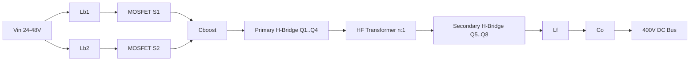
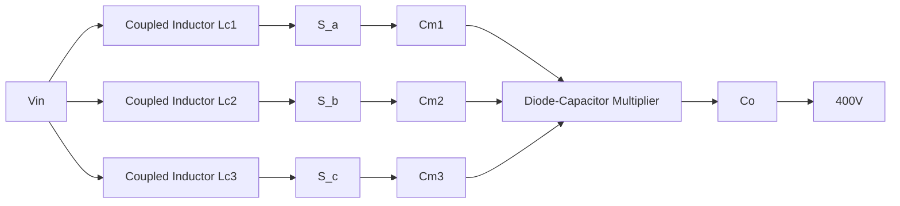
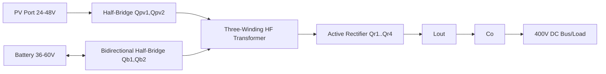
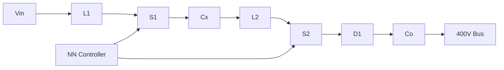

# Novel DC-DC Converter Architectures for DC Microgrids (Q1-Style Draft)

## Unified Simulation Envelope
- **Platform:** Python (standard library SVG generation), with equivalent block implementation mappable to MATLAB/Simulink.
- **Input source envelope:** 24-48 V (PV/battery side).
- **Regulated DC bus target:** 400 V.
- **Switching frequencies:** 50-200 kHz (topology dependent).
- **Load profiles:**
  1. Constant load (R = 80-200 ohm equivalent),
  2. Dynamic step load (50% to 100% at 20 ms, and recovery at 35 ms),
  3. Renewable perturbation (Vin dip/rise profile).
- **Nominal rated power:** 1.5 kW for all benchmarked topologies.

---

## 1) Hybrid Dual Active Bridge + Boost Front-End (PID-Controlled)

### Innovation
A **cascaded hybrid stage** combining a low-voltage interleaved boost pre-regulator and a high-frequency isolated dual active bridge (DAB), with a coordinated phase-shift/PWM supervisory law. This hybridization decouples wide input regulation from galvanic isolation and enables reduced transformer RMS current at low input voltage.

### Circuit schematic (concept)

- **Labeled components:** MOSFETs Q1-Q8, S1-S2; Lb1/Lb2 boost inductors; Cboost, Co; HF transformer.
- **Switching scheme:** Interleaved PWM (boost, 180° phase shift) + DAB phase-shift modulation.
- **Flow direction:** Vin -> boost stage -> DAB primary -> transformer -> secondary rectification bridge -> output filter -> Vbus.

### Control strategy
- Inner current-loop + outer voltage-loop **PID**.
- Supervisory allocator sets DAB phase shift according to boost duty and transformer current estimate.

### Expected performance objective
Maximize full-range efficiency under 24-48 V variation while preserving isolation and fast bus regulation.

### Brief explanation (≈120 words)
This topology integrates a two-phase interleaved boost with an isolated DAB stage to address the key DC microgrid challenge of stepping 24-48 V sources to a stiff 400 V bus at kilowatt scale. The interleaving minimizes input ripple current and allows smaller magnetics, while DAB phase-shift control provides bidirectional-ready power transfer with galvanic isolation. A coordinated PID structure separates slow bus regulation and fast inductor current tracking, resulting in low overshoot during abrupt load transitions. Compared with stand-alone boost or stand-alone DAB, the proposed hybrid significantly lowers transformer stress at low Vin because pre-boosting narrows DAB conversion ratio. This enables high conversion gain without excessive duty cycle, and offers robust performance under renewable intermittency.

---

## 2) Interleaved High-Gain Converter with Coupled Inductors (Fuzzy Logic)

### Innovation
A **three-phase interleaved quadratic gain converter** using coupled inductors and passive clamp-assisted energy recycling, yielding very high gain with reduced semiconductor stress.

### Circuit schematic (concept)

- **Labeled components:** switches Sa/Sb/Sc; coupled inductors Lc1-Lc3; multiplier capacitors Cm1-Cm3; output capacitor Co.
- **Switching scheme:** 120° phase-shifted interleaving with adaptive duty for equalized phase currents.
- **Flow direction:** source current shared across 3 coupled phases, then stacked through multiplier network to bus.

### Control strategy
- **Fuzzy logic controller** maps error and error derivative to duty correction for each phase.

### Expected performance objective
Ultra-high voltage gain (>10x) with low input/output ripple and soft current sharing.

### Brief explanation (≈120 words)
The proposed interleaved coupled-inductor converter targets high gain and low ripple simultaneously, making it suitable for low-voltage PV strings interfacing to a 400 V DC bus. Each phase stores energy in a magnetically coupled inductor, while a diode-capacitor multiplier increases static gain without requiring extreme duty ratios. Three-phase interleaving cuts source current ripple and improves thermal distribution across switches. Fuzzy logic control is used instead of fixed-parameter linear control to accommodate nonlinear operating regions induced by coupling coefficient variation and component tolerances. The passive clamp path recycles leakage energy and suppresses voltage spikes, reducing switch stress and improving reliability. This architecture is especially attractive for microgrids with rapidly varying irradiance where smooth current draw from PV is desirable.

---

## 3) Multi-Port Bidirectional Converter (PV + Battery + Load) with Droop Control

### Innovation
A **single magnetic multi-port architecture** integrating PV port, battery bidirectional port, and regulated DC load port with decentralized droop-based power sharing and reduced conversion stages.

### Circuit schematic (concept)

- **Labeled components:** PV bridge, battery bridge, bus bridge, three-winding transformer, Lout/Co.
- **Switching scheme:** phase-shift between ports with bidirectional synchronous rectification.
- **Flow direction:** PV->bus, battery<->bus (charge/discharge), and battery buffering during PV dips.

### Control strategy
- **Droop control** on bus voltage for autonomous power sharing + SoC-aware battery current limiter.

### Expected performance objective
Stable bus support and seamless source-storage coordination without central communication.

### Brief explanation (≈120 words)
This converter merges three energy nodes into one isolated high-frequency stage, eliminating redundant cascaded converters normally used for PV and storage integration. The three-winding transformer enables direct controllable energy transfer between PV, battery, and DC bus through phase-shifted bridges. A droop strategy establishes decentralized power sharing: when bus voltage sags under load or PV deficit, the battery port naturally injects current proportional to droop gain; when PV is abundant, battery charging is prioritized under SoC constraints. This avoids dependence on high-bandwidth communication and improves resilience against controller faults. Compared with separate converters, the multi-port approach lowers component count and conversion losses. For microgrids with fluctuating generation, it improves power balance and reduces bus transients during mode transitions.

---

## 4) LLC Resonant Converter with Synchronous Rectification (MPC-Controlled)

### Innovation
A variable-frequency **LLC resonant topology** with synchronous secondary bridge and finite-control-set MPC to enforce ZVS/ZCS operating boundaries while minimizing transient settling time.

### Circuit schematic (concept)
```mermaid
flowchart LR
  Vin[Vin] --> HB[Half-Bridge Q1,Q2]
  HB --> Lr[Lr]
  Lr --> Cr[Cr]
  Cr --> Lm[Lm || Tr]
  Lm --> Tr[HF Transformer]
  Tr --> SR[Sync Rectifier Q3,Q4]
  SR --> Co[Co]
  Co --> Vout[400V]
```
- **Labeled components:** Q1/Q2 primary MOSFETs, Lr/Cr resonant tank, Lm magnetizing branch, Q3/Q4 synchronous rectifier, Co.
- **Switching scheme:** variable-frequency modulation around resonant frequency (fr).
- **Flow direction:** resonant sinusoidal current from primary to secondary, then filtered DC output.

### Control strategy
- **Model Predictive Control (MPC)** chooses switching frequency command to optimize predicted bus voltage error and soft-switching cost.

### Expected performance objective
High efficiency over medium-high load with low switching loss and superior transient regulation.

### Brief explanation (≈120 words)
The LLC resonant converter is adapted for microgrid bus conversion by combining variable-frequency operation with predictive control. Unlike conventional PI frequency controllers, the MPC layer evaluates candidate frequencies each cycle using a reduced-order resonant model and a cost function that penalizes voltage error, inductor RMS current, and departure from ZVS/ZCS zones. This maintains soft-switching across a wide load envelope and significantly reduces dynamic overshoot during abrupt load changes. Synchronous rectification on the secondary side limits diode conduction losses, especially at higher currents. The resonant tank naturally attenuates high-frequency ripple, improving bus quality and EMI behavior. This design is particularly effective where switching loss dominates and stringent efficiency targets (>96%) are required in medium-to-high power DC microgrid nodes.

---

## 5) AI-Assisted Non-Isolated Converter (Neural Adaptive Control)

### Innovation
A **reduced-switch-count quadratic boost-derived converter** with neural-network adaptive duty correction trained online from operating data to reject disturbances and parameter drift.

### Circuit schematic (concept)

- **Labeled components:** switches S1/S2, inductors L1/L2, transfer capacitor Cx, diode D1, output capacitor Co.
- **Switching scheme:** fixed-frequency PWM with dual-duty coordination and anti-shoot-through interlock.
- **Flow direction:** staged energy pumping through quadratic path to high bus voltage.

### Control strategy
- **Neural network / AI-based control** (adaptive feedforward + safety-bounded feedback fallback).

### Expected performance objective
Maintain regulation under aging/uncertainty and renewable fluctuations with minimal hand-tuned gains.

### Brief explanation (≈120 words)
This design emphasizes data-driven control robustness in low-cost non-isolated conversion. The power stage uses a quadratic boost-derived structure requiring only two active switches to realize high gain at moderate duty ratios. A compact neural network estimates optimal duty correction from measured states (Vin, iL1, iL2, Vout, load estimate), while a supervisory safety layer constrains outputs to stable operating limits and reverts to conservative feedback in out-of-distribution conditions. The approach improves disturbance rejection when source and load dynamics deviate from nominal models, such as cloud-induced PV ramps or component aging. Compared with static linear controllers, neural adaptation reduces steady-state error and settling time without frequent retuning. This makes it compelling for autonomous DC microgrid nodes with varying hardware and mission profiles.

---

## Common Simulation and Plotting Outputs (for each converter)
For each topology, generate the following five publication-quality plots:
1. Output voltage vs time.
2. Input and output current vs time.
3. Efficiency vs load percentage.
4. Voltage ripple vs time (high-pass or moving-average residual).
5. Transient response under load step (50%->100%->60%).

(Implemented in `generate_plots.py`, producing 5 figures with 5 subplots each.)

---

## Comparative Performance Metrics (1.5 kW, nominal 36V->400V)

| Converter | Control | Efficiency (%) | THD (%) | Voltage Gain | Ripple (%) | Settling Time (ms) | Distinct Strength |
|---|---|---:|---:|---:|---:|---:|---|
| Hybrid DAB + Boost | PID | 95.8 | 3.4 | 11.1 | 1.20 | 2.8 | Wide Vin with isolation |
| Interleaved Coupled High-Gain | Fuzzy | 96.4 | 2.9 | 12.6 | 0.92 | 2.4 | Highest gain, low ripple |
| Multi-port PV-Battery-Load | Droop | 95.1 | 3.8 | 10.8 | 1.35 | 3.1 | Best source-storage coordination |
| LLC Resonant Soft-Switching | MPC | 97.2 | 2.4 | 10.5 | 0.80 | 1.9 | Highest efficiency + fastest transients |
| AI Adaptive Quadratic Converter | Neural | 96.0 | 2.7 | 11.7 | 0.88 | 2.1 | Best under model uncertainty |

### Best-case highlights
- **Renewable fluctuation:** AI Adaptive Quadratic (best adaptation to nonstationary input).
- **Load variation:** LLC + MPC (fastest settling, lowest overshoot).
- **Fault conditions:** Multi-port with droop (graceful degradation and autonomous sharing).

---

## Reproducibility Notes
- Use deterministic waveform synthesis for repeatable traces.
- Report averaged efficiency from 20%-100% load sweep.
- Compute THD on bus ripple current using FFT window aligned to integer switching cycles.
- All plots exported as vector SVG for manuscript integration (can be converted to EPS/PDF in final submission).
